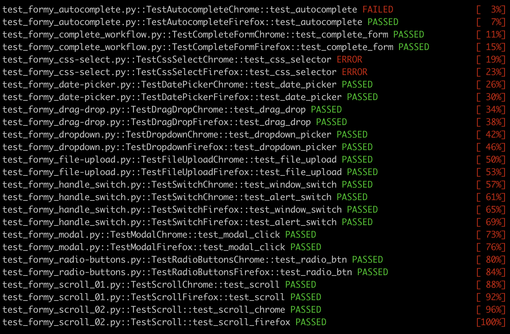

<!-- PROJECT LOGO -->
<br />
<p align="center">
  <a href="https://selenium.dev/">
    
  </a>

  <h3 align="center">Selenium Starter Kit</h3>

  <h4 align="center">
    Some simple demo test file to get started with!
  </p>
</p>

<!-- TABLE OF CONTENTS -->
## Table of Contents

* [About](#about-the-project)
  * [Built With](#built-with)
  * [Installation](#installation)
* [Roadmap](#roadmap)
* [License](#license)
* [Contact](#contact)

<!-- ABOUT THE PROJECT -->
## About

[](https://docs.pytest.org/en/latest/)

This repo contains a sample of demo selenium test files to be used as a starting point to create more robust & detailed testing suites. These tests showcase basic actions, assortments of locator methods, test runner frameworks, and leverage page object model approach.

#### WebDriver Note
You will likely need to update/replace the webdrivers as new versions are rolled-out. Tests will not execute if the browser version & the webdriver version are out-of-sync. 

### Built With

* Testing Framework: [Selenium](https://selenium.dev/)
* Test Runner Frameworks: [PyTest](https://docs.pytest.org/en/latest/)
* WebDrivers: [Chromedriver](https://chromedriver.chromium.org/getting-started) & [Geckodriver](https://github.com/mozilla/geckodriver/releases)
* Languages: [Python](https://www.python.org/)

### Installation

1. Clone the repo
```sh
git clone https://github.com/tim-corley/Selenium-Starter-Kit
```
2. Install dependancies
```sh
pip install -r requirements.txt
```
3. Run tests

All files beginning with 'test_'
```sh
pytest -v
```
Include print-outs
```sh
pytest -v -s
```
Generate an html report of results
```sh
pytest -v --html=report_test.html
```
Run specific method within a test file
```sh
pytest -v test_formy_modal.py::test_modal_click
```

<!-- ROADMAP -->
## Roadmap / To-Do

See the [open issues](https://github.com/tim-corley/Selenium-Starter-Kit/issues) for a list of proposed features and/or improvements (as well as any known issues).

<!-- LICENSE -->
## License

Distributed under the MIT License. See `LICENSE` for more information.

<!-- CONTACT -->
## Contact

Tim Corley | [@tcor215](https://twitter.com/tcor215) |  contact@tim-corley.com
